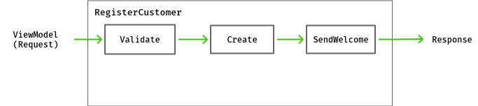
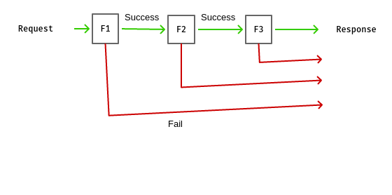
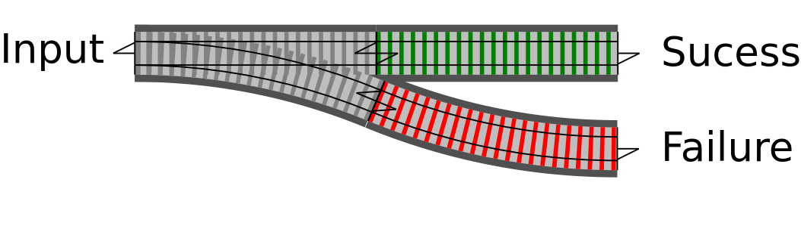
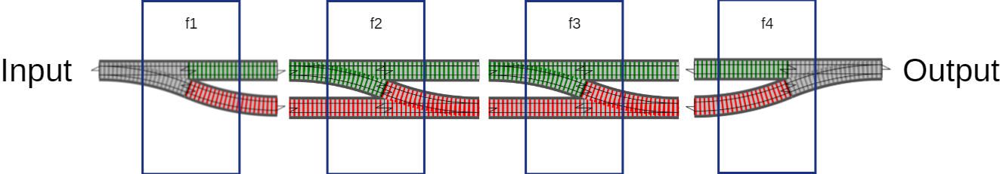
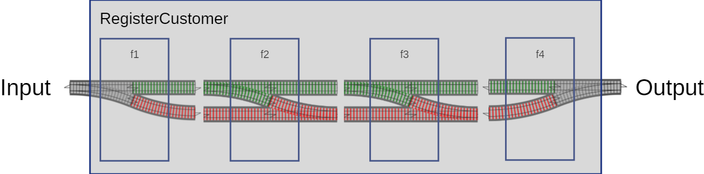
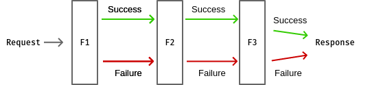
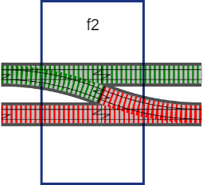

## Railway Oriented Programming
### komplexe Orchestrierung wartbar machen

Patrick Drechsler

<<= x =>>

## Disclaimer

Ich werde nicht erkl&auml;ren, was eine Monade ist

> Wenn man verstanden hat, was eine Monade ist, verliert man die F&auml;higkeit zu erkl&auml;ren, was eine Monade ist.

(Monaden-Paradoxon)

<-- v -->

3min monads fun

[Scott Wlaschin](https://vimeo.com/97344498)

start at: 14.30 end at: 17.30

<<= x =>>

Alle Beispiele sind in **C#**

(geht aber auch alles mit Java)

Umfrage:<!-- .element: class="fragment" data-fragment-index="1" -->
- Java?<!-- .element: class="fragment" data-fragment-index="1" -->
- C#?<!-- .element: class="fragment" data-fragment-index="1" -->
- Javascript/Typescript?<!-- .element: class="fragment" data-fragment-index="1" -->
- Haskell (oder Lisp, OCaml, etc)?<!-- .element: class="fragment" data-fragment-index="1" -->

<<= x =>>

### Orchestrierung

Stelle im Code, die
- selbst wenig interne Logik hat
- viele andere Module/Klassen ben&ouml;tigt
- z.B. den Ablauf einer User Story beschreibt
- oft in "Service" Klasse (z.B. RegistrationService)

<-- v -->

Einfaches Beispiel

```csharp
var customerResult = Validate(createCustomerViewModel);
var result = customerResult
    .OnSuccess(c => _customerRepository.Create(c))
    .OnSuccess(c => _mailConfirmer.SendWelcome(c))
    .OnBoth(cResultAtEnd => cResultAtEnd.IsSuccess
        ? new CustomerCreatedViewModel(cResultAtEnd.Value.Id)
        : CreateErrorResponse(cResultAtEnd.Error));
```

<-- v -->

Realistischeres Beispiel

``` csharp
var result = Validate(createCustomerViewModel)
    .OnSuccess(c => _customerRepository.Create(c))
    .OnSuccess(c => createCustomerViewModel.WantsPremiumSupport
        ? _creditCardGateway.Charge(c.CreditCardNumber)
            .OnSuccess(gateway => gateway.ChargeWasBooked
                ? _customerRepository.UpgradeToPremium(c)
                : _creditCardGateway.RollBackLastTransaction(c))
        : Result.Ok(c))
    .OnSuccess(c => _mailConfirmer.SendWelcome(c))
    .OnBoth(cResultAtEnd => cResultAtEnd.IsSuccess
        ? new CustomerCreatedViewModel(cResultAtEnd.Value.Id)
        : CreateErrorResponse(cResultAtEnd.Error));
```

<<= x =>>

### User Story: Anmeldung als neuer Benutzer
Wenn ein neuer Benutzer sich anmeldet,
- werden seine Eingaben validiert
- wird er im System gespeichert
- erh&auml;lt er eine Best&auml;tigungsmail

<<= x =>>



<pre>
<code data-noescape data-trim class="lang-csharp hljs">
<span class="my-semi-hide-always fragment" data-fragment-index="1">public CustomerCreatedViewModel RegisterCustomer(SomeVM viewModel)</span>
<span class="my-semi-hide-always fragment" data-fragment-index="1">{</span>
    var customer = Validate(viewModel);
    customer = _customerRepository.Create(customer);
    _mailConfirmer.SendWelcome(customer);

    <span class="my-semi-hide-always fragment" data-fragment-index="1">return new CustomerCreatedViewModel(customer);</span>
<span class="my-semi-hide-always fragment" data-fragment-index="1">}</span>    
</code>
</pre>

<!-- .element: class="fragment" data-fragment-index="2" -->
- Cool, wir sind fertig! <!-- .element: class="fragment" data-fragment-index="3" -->
- let's go live... <!-- .element: class="fragment" data-fragment-index="4" -->

<<= x =>>

<section data-background-image="resources/city-desaster.jpg">
    <h2 style="color:darkred">No error handling:</h2>
    <h1 style="color:darkred">What could possibly go wrong?</h1>
</section>

<<= x =>>

*...potentielle Fallstricke...*
<pre>
<code data-noescape data-trim class="lang-csharp hljs">
<span class="mycodemark-highlight">// can fail</span>
var customer = Validate(createCustomerViewModel);

<span class="mycodemark-highlight">// can fail</span>
customer = _customerRepository.Create(customer);

<span class="mycodemark-highlight">// can fail</span>
_mailConfirmer.SendWelcome(customer);

return new CustomerCreatedViewModel(customer.Id) {Success = <span style="color:black;font-weight:bold">??</span>};
</code>
</pre>

<-- v -->

## Just my 2 cents
Nicht einfach drauflos programmieren: Zuerst mit Kunde/Domain-Experten kl&auml;ren!

Dann die User Story aktualisieren (oder neue User Story erstellen)<!-- .element: class="fragment" data-fragment-index="1" -->

<<= x =>>


<pre>
<code data-noescape data-trim class="lang-csharp hljs">
Customer customer;
try { <span class="mycodemark-always">customer = Validate(createCustomerViewModel);</span> }
catch (Exception e) { return CreateErrorResponse(e); }

try { <span class="mycodemark-always">customer = _customerRepository.Create(customer);</span> }
catch (Exception e) { return CreateErrorResponse(e); }

try { <span class="mycodemark-always">_mailConfirmer.SendWelcome(customer);</span> }
catch (Exception e)
{
    // don't fail, but maybe: logging, retry-policy
}

<span class="mycodemark-always">return new CustomerCreatedViewModel(customer.Id);</span>
</code>
</pre>

Note:
- Code ist schwerer zu lesen/warten
- (Trotz kompakter Darstellung)

<<= x =>>


Fehlerbehandlung macht einen Gro&szlig;teil des Codes aus

<<= x =>>

...happy case...


<<= x =>>

...mit Fehlerbehandlung...



<i class="fa fa-frown-o fragment" aria-hidden="true" data-fragment-index="1" style="font-size:3em"></i>

<<= x =>>

### Funktionale Programmierung

Wer m&ouml;chte heute noch auf Lambdas verzichten?

- Was unterscheidet Funktionen von Methoden?<!-- .element: class="fragment" data-fragment-index="1" -->
    - entspricht eher einer math. Funktion (und nicht einer Eigenschaft einer Klasse)<!-- .element: class="fragment" data-fragment-index="2" -->
    - gleiche Eingabe gibt immer gleiches Ergebnis zur&uuml;ck<!-- .element: class="fragment" data-fragment-index="3" -->
    - (idealerweise ohne Seiteneffekte)<!-- .element: class="fragment" data-fragment-index="3" -->
- Funktionen k&ouml;nnen als Eingabe- und R&uuml;ckgabewert verwendet werden ("higher order functions")<!-- .element: class="fragment" data-fragment-index="4" -->

<<= x =>>

<section data-background-image="resources/sheldon-cooper.jpg">
    <h3>Where are the trains?</h3>
    <h2>You promised Railways!</h2>
</section>

<<= x =>>

"Weiche"



(...endlich die Railway Metapher...)

<-- v -->


<-- v -->



<-- v -->



<<= x =>>

Machen wir unser Bildchen "funktionaler"



- F1: wie gehabt<!-- .element: class="fragment" data-fragment-index="1" -->
- F2 und F3: k&ouml;nnen Fehler empfangen (cool)<!-- .element: class="fragment" data-fragment-index="1" -->
- F2 und F3: austauschbar (sehr cool)<!-- .element: class="fragment" data-fragment-index="1" -->

<<= x =>>

**F1**: wirklich wie gehabt? (1: Eingang, 2 Ausg&auml;nge)

***Nein!***

Eigentlich wollen wir das Ergebnis von F1 kapseln, denn F2 erwartet


<-- v -->



<<= x =>>

**F2**: kann Fehler empfangen (2 Eing&auml;nge, 2 Ausg&auml;nge)

- wir m&uuml;ssen ein "Result" als Eingabe verarbeiten k&ouml;nnen

<<= x =>>

Was hat es mit dieser "Result" Klasse auf sich?

<-- v -->

In C# und in Java gibt es aktuell keine "Result" Klasse

<i class="fa fa-frown-o" aria-hidden="true" style="font-size:2em"></i>

- C#: CSharpFunctionalExtensions (NuGet)<!-- .element: class="fragment" data-fragment-index="1" -->
- Java: auch m&ouml;glich (Link im Abspann)<!-- .element: class="fragment" data-fragment-index="1" -->

<i class="fa fa-smile-o fragment" aria-hidden="true" style="font-size:2em" data-fragment-index="1"></i>

<<= x =>>

### C# API

NuGet: CSharpFunctionalExtensions

<<= x =>>

Result&lt;T&gt; als R&uuml;ckgabewert

```csharp
public Result<Customer> CreateCustomer(...)
{
    var customer = ...;
    if (IsValid(customer)) 
    {
        return Result.Ok(customer);
    }
    else
    {
        return Result.Fail<Customer>("Validation failed");
    }
}
```
<<= x =>>

Finden wir zusammen raus, wie "Result" funktioniert

**Mob-Session**

**VIM**


<<= x =>>

### Links

- Scott Wlaschin "the original talk" http://fsharpforfunandprofit.com/rop/
- Stefan Macke "ROP f&uuml;r Java" https://www.heise.de/developer/artikel/Railway-Oriented-Programming-in-Java-3598438.html
- Vladimir Khorikov "Functional C#: Handling failures..." http://enterprisecraftsmanship.com/2015/03/20/functional-c-handling-failures-input-errors/
- CSharpFunctionalExtensions https://github.com/vkhorikov/CSharpFunctionalExtensions

<<= x =>>

# Fragen?

Kontaktinfos:

- <i class="fa fa-twitter" aria-hidden="true"></i>&nbsp;@drechsler
- <i class="fa fa-envelope" aria-hidden="true"></i>&nbsp;socialcoding@pdrechsler.de