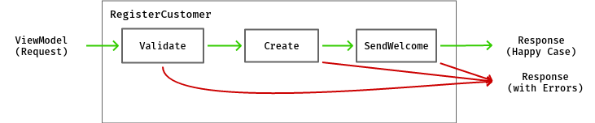

## Railway Oriented Programming
### komplexe Orchestrierung wartbar machen

Patrick Drechsler

<<= x =>>
Zur Person:

- "gelernter" Biologe
- Softwareentwicker bei Redheads Ltd
- .NET, JS
- aktuelle Schwerpunkte: DDD, CQRS
- Softwerkskammer
- <i class="fa fa-twitter" aria-hidden="true"></i>&nbsp;@drechsler
- <i class="fa fa-envelope" aria-hidden="true"></i>&nbsp;patrick.drechsler@redheads.de

Note:
- Gelegentlich wechsle ich von Folien zur IDE
    - Info kann sacken
    - manche Sachen passen nicht auf Folie
    - man sieht alles mal im echten Kontext
    
<!-- <span style="font-family: shlop; color: red;">Monads</span> -->

<<= x =>>

## Disclaimer

Ich werde nicht erkl&auml;ren, was eine Monade ist.

> Wenn man verstanden hat, was eine Monade ist, verliert man die F&auml;higkeit zu erkl&auml;ren, was eine Monade ist.

(Monaden-Paradoxon)

<<= x =>>

Alle Beispiele sind in **C#**

(geht aber auch alles mit Java)

Umfrage:<!-- .element: class="fragment" data-fragment-index="1" -->
- Java?<!-- .element: class="fragment" data-fragment-index="1" -->
- C#?<!-- .element: class="fragment" data-fragment-index="1" -->

<<= x =>>

### Orchestrierung

Stelle im Code, die
- selbst wenig interne Logik hat
- viele andere Module/Klassen ben&ouml;tigt
- z.B. den Ablauf einer User Story beschreibt
- oft in "Service" Klasse (z.B. RegistrationService)

<<= x =>>

"2 Zeilen Code"

```csharp
var customerResult = Validate(createCustomerViewModel);
var result = customerResult
    .OnSuccess(c => _customerRepository.Create(c))
    .OnSuccess(c => _mailConfirmer.SendWelcome(c))
    .OnBoth(cResultAtEnd => cResultAtEnd.IsSuccess
        ? new CustomerCreatedViewModel(cResultAtEnd.Value.Id)
        : CreateErrorResponse(cResultAtEnd.Error));
```

<-- v -->

"1 Zeile Code" 

*Realistischeres Beispiel*
``` csharp
var result = Validate(createCustomerViewModel)
    .OnSuccess(c => _customerRepository.Create(c))
    .OnSuccess(c => createCustomerViewModel.WantsPremiumSupport
        ? _creditCardGateway.Charge(c.CreditCardNumber)
            .OnSuccess(gateway => gateway.ChargeWasBooked
                ? _customerRepository.UpgradeToPremium(c)
                : _creditCardGateway.RollBackLastTransaction(c))
        : Result.Ok(c))
    .OnSuccess(c => _mailConfirmer.SendWelcome(c))
    .OnBoth(cResultAtEnd => cResultAtEnd.IsSuccess
        ? new CustomerCreatedViewModel(cResultAtEnd.Value.Id)
        : CreateErrorResponse(cResultAtEnd.Error));
```

<<= x =>>

### User Story: Anmeldung als neuer Benutzer
Wenn ein neuer Benutzer sich anmeldet,
- werden seine Eingaben validiert
- wird er im System gespeichert
- erh&auml;lt er eine Best&auml;tigungsmail

<<= x =>>


<pre>
<code data-noescape data-trim class="lang-csharp hljs">
<span class="my-semi-hide-always fragment" data-fragment-index="1">public CustomerCreatedViewModel RegisterCustomer(SomeVM viewModel)</span>
<span class="my-semi-hide-always fragment" data-fragment-index="1">{</span>
    var customer = Validate(viewModel);
    customer = _customerRepository.Create(customer);
    _mailConfirmer.SendWelcome(customer);

    <span class="my-semi-hide-always fragment" data-fragment-index="1">return new CustomerCreatedViewModel(customer);</span>
<span class="my-semi-hide-always fragment" data-fragment-index="1">}</span>    
</code>
</pre>

- LIVE-CODING <!-- .element: class="fragment" data-fragment-index="2" -->
- Cool, wir sind fertig! <!-- .element: class="fragment" data-fragment-index="3" -->
- let's go live... <!-- .element: class="fragment" data-fragment-index="4" -->

<<= x =>>

<section>
    <h2 style="color:darkred">No error handling:</h2>
    <h1 style="color:darkred">What could possibly go wrong?</h1>
</section>

<<= x =>>

*...potentielle Fallstricke...*
<pre>
<code data-noescape data-trim class="lang-csharp hljs">
<span class="mycodemark-highlight">// can fail</span>
var customer = Validate(createCustomerViewModel);

<span class="mycodemark-highlight">// can fail</span>
customer = _customerRepository.Create(customer);

<span class="mycodemark-highlight">// can fail</span>
_mailConfirmer.SendWelcome(customer);

return new CustomerCreatedViewModel(customer.Id) {Success = <span style="color:black;font-weight:bold">??</span>};
</code>
</pre>

Note:
ausser man ist selbst der Einzige, der die "Eingabe" bereitstellt: Dann weiss man natuerlich wie sich das System verhaelt.

<<= x =>>

Nicht einfach drauflos programmieren: Zuerst mit Kunde/Domain-Experten kl&auml;ren!

Dann die User Story aktualisieren (oder neue User Story f&uuml;r erstellen)<!-- .element: class="fragment" data-fragment-index="1" -->

<<= x =>>



<pre>
<code data-noescape data-trim class="lang-csharp hljs">
Customer customer;
try { <span class="mycodemark-always">customer = Validate(createCustomerViewModel);</span> }
catch (Exception e) { return CreateErrorResponse(e); }

try { <span class="mycodemark-always">customer = _customerRepository.Create(customer);</span> }
catch (Exception e) { return CreateErrorResponse(e); }

try { <span class="mycodemark-always">_mailConfirmer.SendWelcome(customer);</span> }
catch (Exception e)
{
    // don't fail, but maybe: logging, retry-policy
}

<span class="mycodemark-always">return new CustomerCreatedViewModel(customer.Id);</span>
</code>
</pre>

LIVE CODING<!-- .element: class="fragment" data-fragment-index="1" -->

Note:
- Code ist schwerer zu lesen/warten
- (Trotz kompakter Darstellung)

<<= x =>>


- Fehlerbehandlung macht einen Gro&szlig;teil des Codes aus
- Ergebnis einer vorherigen Aktion ist Grundlage f&uuml;r weiteres Vorgehen <!-- .element: class="fragment" data-fragment-index="1" -->

<<= x =>>

...happy case...


<<= x =>>

...mit Fehlerbehandlung...


<i class="fa fa-frown-o fragment" aria-hidden="true" data-fragment-index="1" style="font-size:3em"></i>

<<= x =>>

### Funktionale Programmierung

Wer m&ouml;chte heute noch auf Lambdas verzichten?

- Was unterscheidet Funktionen von Methoden?<!-- .element: class="fragment" data-fragment-index="1" -->
    - entspricht eher einer math. Funktion (und nicht einer Eigenschaft einer Klasse)<!-- .element: class="fragment" data-fragment-index="2" -->
    - gleiche Eingabe gibt immer gleiches Ergebnis zur&uuml;ck<!-- .element: class="fragment" data-fragment-index="3" -->
    - (idealerweise ohne Seiteneffekte)<!-- .element: class="fragment" data-fragment-index="3" -->
- Funktionen k&ouml;nnen als Eingabe- und R&uuml;ckgabewert verwendet werden ("higher order functions")<!-- .element: class="fragment" data-fragment-index="4" -->

<<= x =>>

<section>
    <h3>Where are the trains?</h3>
    <h2>You promised Railways!</h2>
</section>

<<= x =>>

"Weiche"


(...endlich die Railway Metapher...)

<<= x =>>


<<= x =>>

Machen wir unser Bildchen "funktionaler"


- F1: wie gehabt<!-- .element: class="fragment" data-fragment-index="1" -->
- F2 und F3: k&ouml;nnen Fehler empfangen (cool)<!-- .element: class="fragment" data-fragment-index="1" -->
- F2 und F3: austauschbar (sehr cool)<!-- .element: class="fragment" data-fragment-index="1" -->

<<= x =>>

**F1**: wirklich wie gehabt? (1: Eingang, 2 Ausg&auml;nge)

***Nein!***<!-- .element: class="fragment" data-fragment-index="1" -->

Eigentlich wollen wir das Ergebnis kapseln (damit wir es sp&auml;ter verketten k&ouml;nnen)<!-- .element: class="fragment" data-fragment-index="1" -->

<!-- .element: class="fragment" data-fragment-index="1" -->

<<= x =>>

**F2**: kann Fehler empfangen (2 Eing&auml;nge, 2 Ausg&auml;nge)

- wir m&uuml;ssen ein "Result" als Eingabe verarbeiten k&ouml;nnen

<<= x =>>

Was hat es mit dieser "Result" Klasse auf sich?

"Result" basiert auf "Maybe"...

<-- v -->

### Objektorientierung und NULL

> Tony Hoare introduced Null references in ALGOL W back in 1965 "simply because it was so easy to implement", says Mr. Hoare. He talks about that decision considering it "my billion-dollar mistake".

<p class="small">https://www.infoq.com/presentations/Null-References-The-Billion-Dollar-Mistake-Tony-Hoare</p>

<-- v -->
darum schreiben wir...
```csharp
Customer customer = repo.GetById(42);
if (customer == null) {
    // error handling
    // is it NULL because 
    // - no result was found
    // - or for another reason?
}
else {
    // happy case
}
```

<-- v -->
darum brauchen wir...
```csharp
Maybe<Customer> customer = repo.GetById(42);
if (customer.HasValue) {
    // happy case
    DoSomething(customer.Value.FirstName);
}
else {
    // error handling
}
```

(zumindest ist klar, was gemeint ist)

<-- v -->

### C# vs Java

- F&uuml;r C# spricht:
    - Lernt oft von Java
    - weniger Boilerplate (Properties vs getter/setter)
    - Lambdas
    - Pattern Matching (seit C# 7)

Aber Java holt wieder auf: Java hat eine Option Klasse!

<<= x =>>

In C# und in Java gibt es aktuell keine "Result" Klasse

<i class="fa fa-frown-o" aria-hidden="true" style="font-size:2em"></i>

- C#: CSharpFunctionalExtensions (NuGet)<!-- .element: class="fragment" data-fragment-index="1" -->
- Java: auch m&ouml;glich (Link im Abspann)<!-- .element: class="fragment" data-fragment-index="1" -->

<i class="fa fa-smile-o fragment" aria-hidden="true" style="font-size:2em" data-fragment-index="1"></i>

<<= x =>>

### C# API

NuGet: CSharpFunctionalExtensions

<<= x =>>

#### Result&lt;T&gt; erstellen

```csharp
Result<Customer> r1 = Result.Ok(customer);
Result<Customer> r2 = Result.Fail<Customer>("Something failed");
```

(ja, Failure ist vom Typ String)<!-- .element: class="fragment" data-fragment-index="1" -->

Note:
- stellt sich raus, dass Failure/String fuer fast alles langt!

<-- v -->

Result&lt;T&gt; als R&uuml;ckgabewert

```csharp
public Result<Customer> CreateCustomer(...)
{
    var customer = ...;
    if (IsValid(customer)) 
    {
        return Result.Ok(customer);
    }
    else
    {
        return Result.Fail<Customer>("Validation failed");
    }
}
```

<<= x =>>

### Kombination von Results

(via Extension Methods)

- OnSuccess
- OnBoth
- OnFailure

<-- v -->

Extension Methods in C#

sind sowas wie "traits" (Scala) oder "mixins" (Ruby)
 

<<= x =>>
API OnSuccess:

```csharp
public static Result OnSuccess(this Result result, Func<Result> func)

public static Result<T> OnSuccess<T>(this Result result, Func<T> func)

public static Result<K> OnSuccess<T, K>(this Result<T> result, 
                                        Func<Result<K>> func)

//...                                        
```


<<= x =>>
API OnBoth:

```csharp
public static T OnBoth<T>(this Result result, Func<Result, T> func)

public static K OnBoth<T, K>(this Result<T> result, 
                                  Func<Result<T>, K> func)
```


<<= x =>>
API OnFailure:

```csharp
public static Result OnFailure(this Result result, Action action)

public static Result<T> OnFailure<T>(this Result<T> result, Action<string> action)

//...                                        
```


<<= x =>>

LIVE CODING

<<= x =>>

### Links

- Scott Wlaschin "the original talk" http://fsharpforfunandprofit.com/rop/
- Stefan Macke "ROP f&uuml;r Java" https://www.heise.de/developer/artikel/Railway-Oriented-Programming-in-Java-3598438.html
- Vladimir Khorikov "Functional C#: Handling failures..." http://enterprisecraftsmanship.com/2015/03/20/functional-c-handling-failures-input-errors/
- CSharpFunctionalExtensions https://github.com/vkhorikov/CSharpFunctionalExtensions

<<= x =>>

# Fragen?

Kontaktinfos:

- <i class="fa fa-twitter" aria-hidden="true"></i>&nbsp;@drechsler
- <i class="fa fa-envelope" aria-hidden="true"></i>&nbsp;patrick.drechsler@redheads.de